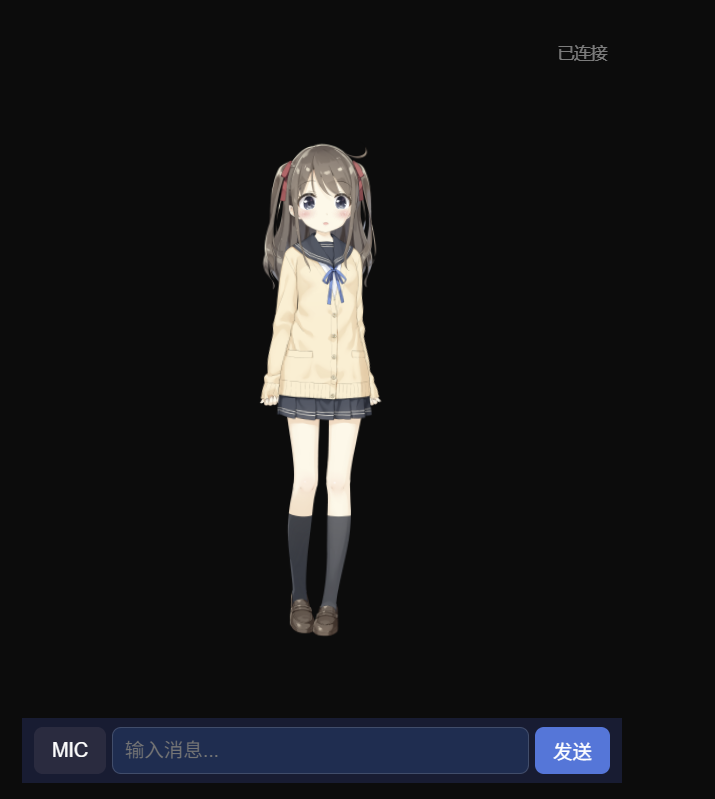
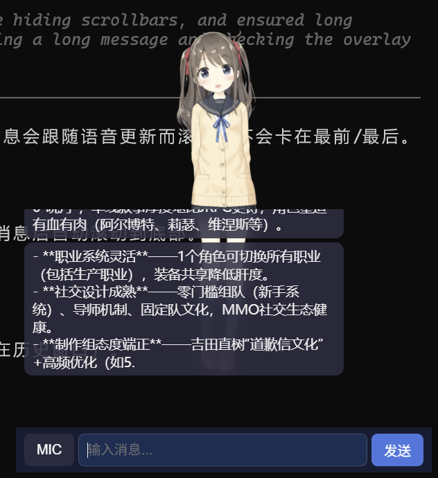
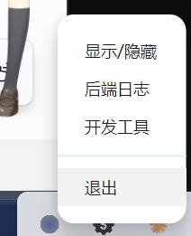

<div align="center">

<!-- TODO: logo / banner -->
<!--  -->

# 灰风 GreyWind

**你桌面上的 AI。能看你的屏幕，能听你说话，能帮你干活，还能记住你。**

[](https://python.org)
[](https://nodejs.org)
[](LICENSE)
[](https://github.com)
<!-- [](https://github.com/YOUR_USERNAME/greywind) -->
<!-- [](https://discord.gg/YOUR_INVITE) -->

[English](./README_EN.md) | **中文**

</div>

<br>

<p align="center">
  
  
  
</p>
<p align="center"><em>待机 · 聊天 · 系统托盘</em></p>

<p align="center">
  <a href="#-为什么叫灰风">名字由来</a> · <a href="#-快速开始">快速开始</a> · <a href="#-文档">文档</a> · <a href="#-参与开发">参与开发</a>
</p>

---

## 为什么做灰风

我受够了每次打开 AI 都要重新介绍自己。

ChatGPT 是一个网页标签。Claude 是一个对话框。Codex 是一个终端。用完关掉，下次再打开，它已经不认识你了。

我想要的很简单：

- **一个一直在桌面上的 AI**，我能看见它
- **它能看我的屏幕**，知道我在干什么
- **我可以直接对它说话**，它也能说话
- **关掉再打开，它还是同一个人**
- **需要时它能帮我操作电脑**，而不只是聊天

所以我做了灰风。

---

## 为什么叫灰风

> *德萨努人创造了一种全新的纳米机器人，他们称之为"纳-迪-沙"，在他们的语言中，意思是灰色风暴。*
>
> *纳米机器犹如黑色的暴雨云一般席卷了星球的表面，开始消耗表面上的所有东西来复制他们的族群。*
>
> —— 群星 Stellaris · [灰蛊风暴 Grey Tempest](https://qunxing.huijiwiki.com/wiki/%E7%81%B0%E8%9B%8A%E9%A3%8E%E6%9A%B4)

灰风的名字来自 P 社玩家心照不宣的梗——《群星》里的**灰蛊风暴**，不是权力的游戏的冰原狼。

L 星团深处，由纳米机器人构成的灰蛊风暴，在漫长的等待中不仅重建了造物主文明，更化身为一个独一无二的个体。她强大到足以席卷整个星系，却选择时刻伴你左右，知晓你所有的历史。

这种"一人成军"的力量与"时刻陪伴"的亲密感，正是这个项目的灵魂：

- **时刻陪伴** — 不是用完即走的网页标签，而是一直在你桌面上、能看见你、能记住每一次对话的个体。关掉再打开，它还是同一个"她"。
- **强而有力** — 不只是聊天机器人。背后调度着 Claude Code、Codex 等 CLI，能看你的屏幕、能操作你的电脑，整个蜂巢执行系统在运转。
- **纳米蜂巢** — 正如灰蛊风暴是无数纳米机器人组成的格式塔个体，灰风也是由感知壳、上下文运行时、多模型执行层共同构成的统一系统。对外只有一个完整人格，对内是无数"纳米机器人"在协同。

灰风，是从《群星》的科幻史诗里走出来的一份念想：一个由纳米蜂巢构成的、强而有力的、会一直陪在你身边的桌面 AI。

---

## 它能做什么

| | 能力 | 说明 |
|:---:|------|------|
| 👁️ | **看你的屏幕** | 截图 + Vision API · 窗口感知 · 知道你在做什么 |
| 👂 | **听你说话** | 麦克风 · VAD · ASR · 说到一半可以打断它 |
| 🗣️ | **对你说话** | TTS · Live2D 口型同步 · 表情联动 |
| 🧠 | **记住你** | 跨会话上下文延续 · 不是每次从零开始 |
| 🖥️ | **帮你干活** | 浏览器操控 · 桌面操作 · Shell · 文件管理 |
| 📺 | **Live2D 直播** | 角色直接推流 · 弹幕互动 · 自主直播 |
| 🤖 | **调度多个 AI** | 底层按需调度 Claude Code / Codex / Gemini CLI，对你透明 |

> 对外只有灰风。底层的模型和 CLI 全部隐藏。
> 类似 [Cat Cafe](https://github.com/zts212653/cat-cafe-tutorials) 的思路：对外暴露角色，执行器不可见。

---

## 它和别的项目有什么不同

| | ChatGPT | OpenClaw | MaiBot | Open Interpreter | **灰风** |
|---|---|---|---|---|---|
| **你看到的** | 网页对话框 | 消息里的文字 | QQ 群里的文字 | 终端 | **桌面 Live2D 角色** |
| **它能看到你** | ❌ | ❌ | ❌ | ❌ | **截图 + Vision** |
| **语音优先** | 后加的 | 后加的 | ❌ | ❌ | **Spine 自带** |
| **角色感** | 弱 | 无 | 强 | 无 | **Live2D + 人格** |
| **跨会话连续** | ❌ | Session | 部分 | ❌ | **Thread + Handoff** |
| **桌面操作** | ❌ | ❌ | ❌ | ✅ | **✅** |
| **多模型后端** | 单 | 单 | 单 | 单 | **多 CLI 协作** |

一句话总结：

- **OpenClaw** = 你消息里的 AI（WhatsApp / Telegram / Slack）
- **MaiBot** = 你群聊里的 AI（QQ）
- **灰风** = **你电脑里的 AI**（桌面常驻 · 能看能听能做）

---

## 快速开始

> ⚠️ 项目处于早期开发阶段。当前正在实现最小骨架（Spine），还不是完整可用的产品。

### 前置条件

- Python 3.12+
- [uv](https://docs.astral.sh/uv/)（Python 包管理）
- Node.js 18+
- 硅基流动 API Key（[注册](https://cloud.siliconflow.cn)，免费送额度）

### 安装

```bash
# 克隆
git clone https://github.com/zuiho-kai/Greyfield.git
cd Greyfield

# 后端依赖
uv sync

# 配置
cp conf.example.yaml conf.yaml
# 编辑 conf.yaml，填入你的硅基流动 API Key

# 前端依赖
cd frontend/desktop && npm install
```

### 启动

```bash
# 终端 1：启动后端
uv run python -m greywind.run

# 终端 2：启动 Electron 前端
cd frontend/desktop && npm start
```

打开后在底部输入框打字，或点 MIC 按钮说话。

> 首次启动会自动下载 Live2D 示例模型（Hiyori Momose）到本地缓存目录。
> 下载源：[nizima Sample Models - Hiyori](https://docs.nizima.com/en/my-live2d-model/using-sample-models/)。
> 使用该模型需遵守
> [Live2D Free Material License Agreement](https://www.live2d.com/eula/live2d-free-material-license-agreement_en.html)
> 与 [Live2D Sample Data Terms](https://www.live2d.com/eula/live2d-sample-data-terms_en.html)。

---

## 怎么跑的

```
你（语音 / 文字 / 屏幕）
 ↓
┌─────────────────────────────────────────┐
│          灰风 · Persona Shell           │
│   Live2D · 语音 · 口型 · 表情 · 打断    │
└──────────────────┬──────────────────────┘
                   ↓
┌──────────────────────────────────────────┐
│          Context Runtime                 │
│   谁在说话 · 在哪条线 · 上次聊到哪       │
└──────────────────┬───────────────────────┘
                   ↓
┌──────────────────────────────────────────┐
│          执行层（对你不可见）              │
│   Claude Code · Codex · Gemini CLI       │
│   Browser · Desktop · Shell · File       │
└──────────────────────────────────────────┘
```

灰风不重新发明 coding CLI。它用已有的最强 CLI 做执行，自己只做两件事：

1. **感知层** — Live2D、语音、读屏，让你和 AI 的交互像面对一个"人"
2. **上下文运行时** — 让 AI 在跨会话时还是同一个角色，而不是每次重来

> 架构细节：[architecture-v2.md](./docs/architecture-v2.md) · 上下文设计：[context-runtime.md](./docs/context-runtime.md)

---

## Roadmap

**Minimal Spine → Module 生长**：先活起来，再长出能力。

### Phase 1 — 先活起来 `✅ 完成`

- [x] 配置系统（conf.yaml + Pydantic 校验）
- [x] JSON 记忆存储
- [x] Context Runtime（Session / Thread / Prompt 装配）
- [x] LLM 对话（硅基流动 Step-3.5-Flash）
- [x] 语音输入（VAD Silero + ASR 硅基流动 SenseVoiceSmall）
- [x] 流式 TTS（硅基流动 CosyVoice2）
- [x] WebSocket 消息管线（文字 + 语音）
- [x] Electron 桌面壳（文字输入 + 麦克风 + 音频播放）
- [x] 语音打断
- [x] Live2D 角色接入
- [x] 口型同步 + 基础表情
- [x] Electron 打包（灰风.exe 一键启动）
- [x] 系统托盘 + 后端日志窗口
- [x] 高 DPI 清晰度 + 透明桌面宠物模式
- [x] Live2D 窗口鼠标穿透 + 手动拖拽

### Phase 2 — 能看能做 `← 当前`

- [x] 屏幕感知（截图 + Vision · 差异检测 · 主动播报）
- [ ] 自定义音色克隆
- [ ] 浏览器操控（Playwright）
- [ ] 桌面操控（pyautogui）
- [ ] Live2D 直播（OBS 推流 · 弹幕互动 · 自主直播）
- [ ] 聊天历史清空按钮 / 菜单项
- [ ] 聊天历史按日期分文件（天 / 周滚动）

### Phase 3 — 长出系统

- [ ] 主控 / 蜂巢多 Agent
- [ ] 任务系统
- [ ] 持久化记忆（向量 + 图谱）
- [ ] 历史存储抽象层（MongoDB / 向量库）
- [ ] Web Dashboard
- [ ] Skill / 插件平台

---

## 遗留问题

- 聊天历史清空按钮 / 菜单项
- 聊天历史按日期分文件（天 / 周滚动）
- 历史存储抽象层（MongoDB / 向量库）
- PR #9：托盘功能是否纳入 Spine 阶段（待确认）
- PR #9：后端日志窗口是否纳入 Spine 阶段（待确认）
- PR #9：聊天历史写盘（`history.json`）是否仅限 UI 展示且不参与上下文（待确认）
- PR #9：Live2D 示例模型自动下载的许可与分发说明是否需要补充（待确认）
- PR #9：Electron 打包 / 自启相关改动是否提前进入 Spine 阶段（待确认）
- PR #9：新增 `preload` / `renderer` 文件是否超出 `docs/spine-now.md` 允许范围（待确认）

## 参与开发

**灰风现在是早期，正是参与的最好时机。**

### 当前最需要的方向

| 方向 | 说明 | 难度 |
|------|------|:----:|
| 🌐 **浏览器操控** | Playwright + function calling + 风险分级 | ⭐⭐⭐ |
| 🖱️ **桌面操控** | pyautogui · 截图定位 · 操作序列 | ⭐⭐⭐ |
| 🎤 **音色克隆** | 自定义 TTS 音色 · CosyVoice2 fine-tune | ⭐⭐⭐ |
| 📺 **Live2D 直播** | OBS 推流 · 弹幕互动 · 自主直播 | ⭐⭐ |
| 🔌 **Skill 系统** | 设计插件机制，让社区能贡献能力而不碰核心 | ⭐⭐ |
| 📖 **文档 / 翻译** | README · 文档英文化 · 教程 | ⭐ |

### 怎么开始

```bash
git clone https://github.com/zuiho-kai/Greyfield.git
git checkout -b feat/your-feature
# 改完提 PR
```

> 不知道从哪下手？看 **[spine-now.md](./docs/spine-now.md)** 了解当前阶段具体需求，或直接开 Issue 聊。
>
> 灰风的目标是做成 **OpenClaw 那样的开放生态** — 核心保持精简，能力通过 Skill / 插件长出来。

---

## 文档

| 文档 | 内容 |
|------|------|
| **[spine-now.md](./docs/spine-now.md)** | 当前只做什么、不做什么 |
| **[greywind-implementation-spec.md](./docs/greywind-implementation-spec.md)** | 施工规格 · 目录 · 配置 · 协议 |
| **[architecture-v2.md](./docs/architecture-v2.md)** | 系统中轴 · 三条轴 |
| **[context-runtime.md](./docs/context-runtime.md)** | 上下文装配 · Thread / Session / Handoff |
| **[MAP.md](./docs/MAP.md)** | 文档地图 |

---

## 站在谁的肩上

| 来源 | 吸收了什么 |
|------|-----------|
| [Open-LLM-VTuber](https://github.com/Open-LLM-VTuber/Open-LLM-VTuber) | ASR / TTS / VAD / LLM / Live2D 引擎（MIT，直接搬运） |
| [airi](https://github.com/moeru-ai/airi) | 自托管 AI 伴侣 · 实时语音 · 游戏交互思路 |
| [Cat Cafe](https://github.com/zts212653/cat-cafe-tutorials) | 多 CLI 角色化协作 · 对外只暴露角色 |
| [OpenClaw](https://github.com/openclaw/openclaw) | Gateway / 分层记忆 · Skill 生态思路 |
| Neuro | 桌面 AI 存在感 · 多模态陪伴 |

---

## 社区

<!-- TODO: 替换为真实链接 -->

| 平台 | 链接 | 说明 |
|------|------|------|
| **QQ 群** | [加入](#) | 日常交流 · 问题答疑 |
| **Discord** | [加入](#) | 英文社区 · 开发讨论 |
| **Issues** | [GitHub](https://github.com/YOUR_USERNAME/greywind/issues) | Bug · 功能建议 |
| **Discussions** | [GitHub](https://github.com/YOUR_USERNAME/greywind/discussions) | 开放讨论 |

---

<!-- TODO: 替换 YOUR_USERNAME -->
<!-- [](https://star-history.com/#YOUR_USERNAME/greywind&Date) -->

<div align="center">

**大多数 AI 每次对话都是一个新的人。灰风不是。**

如果你觉得这个方向有意思，⭐ 就是最大的支持。

</div>
