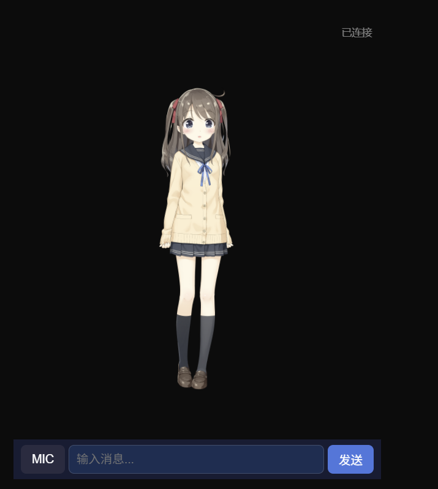
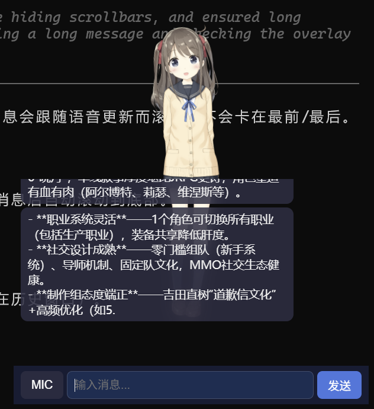
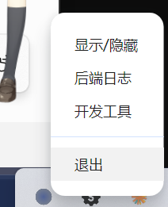
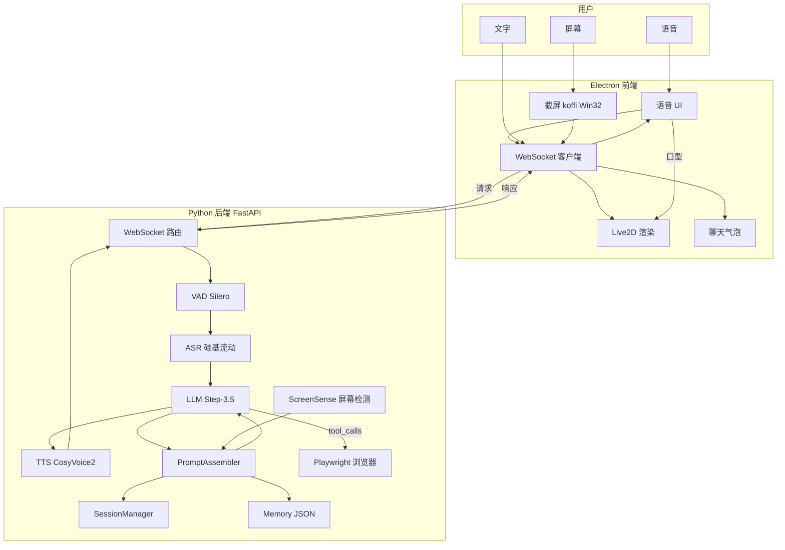

<div align="center">

# 灰风 GreyWind

**你桌面上的 AI。能看你的屏幕，能听你说话，能帮你干活，还能记住你。**

[](https://python.org)
[](https://nodejs.org)
[](https://www.electronjs.org)
[](LICENSE)
[](https://github.com/zuiho-kai/Greyfield)
[](https://github.com/zuiho-kai/Greyfield/graphs/contributors)

[English](./README_EN.md) | **中文**

<!-- TODO: 录一个 30 秒演示 gif 替换下面的静态截图 -->
<!--  -->

</div>

<p align="center">
  
  
  
</p>
<p align="center"><em>待机 · 聊天 · 系统托盘</em></p>

<p align="center">
  <!-- <a href="https://github.com/zuiho-kai/Greyfield/releases">⬇️ 下载 exe</a> · -->
  <a href="#快速开始">📖 快速开始</a> · <a href="https://github.com/zuiho-kai/Greyfield/discussions">💬 加入讨论</a> · <a href="#参与开发">🤝 参与开发</a>
</p>

---

我受够了每次打开 AI 都要重新介绍自己。灰风是一个一直在你桌面上的 AI——能看你的屏幕，能听你说话，关掉再打开，她还是同一个人。不是网页标签，不是终端，是桌面上的一个角色。

<details>
<summary><strong>为什么叫灰风？</strong></summary>

> *德萨努人创造了一种全新的纳米机器人，他们称之为"纳-迪-沙"，在他们的语言中，意思是灰色风暴。*
>
> *纳米机器犹如黑色的暴雨云一般席卷了星球的表面，开始消耗表面上的所有东西来复制他们的族群。*
>
> —— 群星 Stellaris · [灰蛊风暴 Grey Tempest](https://qunxing.huijiwiki.com/wiki/%E7%81%B0%E8%9B%8A%E9%A3%8E%E6%9A%B4)

灰风的名字来自 P 社玩家心照不宣的梗——《群星》里的**灰蛊风暴**，不是权力的游戏的冰原狼。

L 星团深处，由纳米机器人构成的灰蛊风暴，在漫长的等待中不仅重建了造物主文明，更化身为一个独一无二的个体。她强大到足以席卷整个星系，却选择时刻伴你左右，知晓你所有的历史。

- **时刻陪伴** — 不是用完即走的网页标签，而是一直在你桌面上、能看见你、能记住每一次对话的个体。关掉再打开，它还是同一个"她"。
- **强而有力** — 不只是聊天机器人。背后调度着 Claude Code、Codex 等 CLI，能看你的屏幕、能操作你的电脑，整个蜂巢执行系统在运转。
- **纳米蜂巢** — 正如灰蛊风暴是无数纳米机器人组成的格式塔个体，灰风也是由感知壳、上下文运行时、多模型执行层共同构成的统一系统。对外只有一个完整人格，对内是无数"纳米机器人"在协同。

</details>

---

## 它能做什么

| | 能力 | 说明 | 状态 |
|:---:|------|------|:----:|
| 👁️ | **看你的屏幕** | 截图 + Vision API · 差异检测 · 知道你在做什么 | ✅ |
| 👂 | **听你说话** | 麦克风 · VAD · ASR · 说到一半可以打断它 | ✅ |
| 🗣️ | **对你说话** | 流式 TTS · Live2D 口型同步 · 表情联动 | ✅ |
| 🧠 | **记住你** | 跨会话上下文延续 · 不是每次从零开始 | ✅ |
| 🖥️ | **桌面宠物** | 透明窗口 · 鼠标穿透 · 拖拽 · 高 DPI · 系统托盘 | ✅ |
| 📦 | **一键启动** | Electron 打包 · `build.bat` 构建 exe | ✅ |
| 🎤 | **自定义音色** | 音色克隆 · 试听 · 管理 UI | ✅ |
| 🌐 | **浏览器操控** | Playwright + function calling · 并行搜索（需 `uv sync --extra browser` + 配置启用） | ✅ |
| 🖱️ | **桌面操控** | pyautogui · 截图定位 · 操作序列（需配置启用） | ✅ |
| 🎭 | **Live2D 模型切换** | 设置窗口导入 / 切换 / 删除模型 | ✅ |
| 📺 | **Live2D 直播** | OBS 推流 · 弹幕互动 · 自主直播 | 规划中 |
| 🤖 | **多 Agent 协作** | 底层按需调度多个 AI CLI，对你透明 | 规划中 |

> 对外只有灰风。底层的模型和 CLI 全部隐藏。

---

## 它和别的项目有什么不同

| | ChatGPT | MaiBot | my-neuro | Open Interpreter | **灰风** |
|---|---|---|---|---|---|
| **你看到的** | 网页对话框 | QQ 群里的文字 | 桌面 Live2D | 终端 | **桌面 Live2D 角色** |
| **它能看到你** | ❌ | ❌ | 截图 | ❌ | **截图 + Vision** |
| **语音优先** | 后加的 | ❌ | ✅ | ❌ | **核心链路自带** |
| **角色感** | 弱 | 强 | 强 | 无 | **Live2D + 人格** |
| **跨会话连续** | ❌ | 部分 | 截断窗口 | ❌ | **Thread + Session** |
| **桌面存在感** | ❌ | ❌ | ✅ | ❌ | **透明窗口 · 桌面宠物** |

一句话总结：

- **MaiBot** = 你群聊里的 AI（QQ）
- **my-neuro** = 你桌面上的 AI 工作台（模块拼装 · 可训练声音和性格）
- **灰风** = **你电脑里的 AI**（桌面常驻 · 能看能听能说 · 人格连续）

---

## 快速开始

### 前置条件

| 依赖 | 版本 | 说明 |
|------|------|------|
| [Python](https://python.org) | 3.10+ | 后端运行时 |
| [uv](https://docs.astral.sh/uv/) | 最新 | Python 包管理，替代 pip |
| [Node.js](https://nodejs.org) | 18+ | 前端 Electron 构建 |
| [Git](https://git-scm.com) | 最新 | 版本控制 |
| 硅基流动 API Key | — | [注册](https://cloud.siliconflow.cn)，免费送额度，用于 LLM / ASR / TTS |

> 没装 uv？一行搞定：`pip install uv` 或 `curl -LsSf https://astral.sh/uv/install.sh | sh`

### 安装

**Windows 一键安装：**

```bash
git clone https://github.com/zuiho-kai/Greyfield.git
cd Greyfield

# 双击 一键安装依赖.bat 自动安装全部依赖（Python + 前端）

# 配置
cp conf.example.yaml conf.yaml
# 编辑 conf.yaml，把三处 "你的硅基流动API Key" 替换为你的 Key
```

**手动安装：**

```bash
git clone https://github.com/zuiho-kai/Greyfield.git
cd Greyfield

# 1. 后端 Python 依赖（uv 会自动创建虚拟环境）
uv sync

# 2. 前端依赖
cd frontend/desktop
npm install
cd ../..

# 3. 配置
cp conf.example.yaml conf.yaml
```

编辑 `conf.yaml`，把三处 `你的硅基流动API Key` 替换为你的 Key：

```yaml
llm:
  api_key: "sk-xxx"    # ← 你的硅基流动 API Key

asr:
  api_key: "sk-xxx"    # ← 同一个 Key

tts:
  api_key: "sk-xxx"    # ← 同一个 Key
```

### 启动

```bash
# 终端 1：后端
uv run python -m greywind.run

# 终端 2：前端
cd frontend/desktop && npm start
```

打开后在底部输入框打字，或点 MIC 按钮说话。

> 首次启动会自动下载 Live2D 示例模型（Hiyori Momose）。
> 使用该模型需遵守 [Live2D Free Material License Agreement](https://www.live2d.com/eula/live2d-free-material-license-agreement_en.html) 与 [Live2D Sample Data Terms](https://www.live2d.com/eula/live2d-sample-data-terms_en.html)。

> **一键 exe**：打包支持已就绪（`build.bat`），Release 发布后会在此提供下载链接。

### 常见问题

| 问题 | 解决 |
|------|------|
| `uv: command not found` | `pip install uv` 或参考 [uv 安装文档](https://docs.astral.sh/uv/getting-started/installation/) |
| `npm install` 报 node-gyp 错误 | 确认 Node.js >= 18，Windows 用户需安装 [Visual Studio Build Tools](https://visualstudio.microsoft.com/visual-cpp-build-tools/) |
| 后端启动报 `conf.yaml not found` | 复制 `conf.example.yaml` 为 `conf.yaml` 并填入 API Key |
| Live2D 模型下载失败 | 检查网络连接，或手动下载模型放入 `models/` 目录 |

---

## 怎么跑的

### 系统架构


```mermaid
graph TB
  subgraph User["用户"]
    voice["语音"]
    text["文字"]
    screen["屏幕"]
  end

  subgraph Electron["Electron 前端"]
    screenshot["截屏 koffi Win32"]
    live2d["Live2D 渲染"]
    voice_ui["语音 UI"]
    chat["聊天气泡"]
    ws_client["WebSocket 客户端"]
  end

  subgraph Python["Python 后端 FastAPI"]
    ws_handler["WebSocket 路由"]
    vad["VAD Silero"]
    asr["ASR 硅基流动"]
    llm["LLM Step-3.5"]
    tts["TTS CosyVoice2"]
    assembler["PromptAssembler"]
    session["SessionManager"]
    memory["Memory JSON"]
    browser["Playwright 浏览器"]
    screen_sense["ScreenSense 屏幕检测"]
  end

  voice --> voice_ui --> ws_client
  text --> ws_client
  screen --> screenshot --> ws_client

  ws_client -->|请求| ws_handler
  ws_handler -->|响应| ws_client

  ws_handler --> vad --> asr --> llm --> tts --> ws_handler

  llm --> assembler
  assembler --> llm
  assembler --> session
  assembler --> memory
  llm -->|tool_calls| browser
  screen_sense --> assembler

  ws_client --> voice_ui
  ws_client --> chat
  ws_client --> live2d
  voice_ui -->|口型| live2d
```

灰风不重新发明 coding CLI。它用已有的最强 CLI 做执行，自己只做两件事：

1. **感知层** — Live2D、语音、读屏，让你和 AI 的交互像面对一个"人"
2. **上下文运行时** — 让 AI 在跨会话时还是同一个角色，而不是每次重来

> 架构细节：[architecture-v2.md](./docs/architecture-v2.md) · 上下文设计：[context-runtime.md](./docs/context-runtime.md)

### 调用链路

一次完整的语音对话，从你开口到灰风回话：

```
你说话
  ↓
[前端] 麦克风录制 (voice-ui.js)
  navigator.mediaDevices → AudioContext → PCM16 16kHz
  每 4096 样本 → base64 → WebSocket "audio_chunk"
  ↓
[后端] WebSocket 路由 (ws_handler.py)
  base64 解码 → float32 → pipeline.feed_audio()
  ↓
[后端] VAD 语音检测 (voice_pipeline.py → silero VAD)
  检测到语音段结束 → 送 ASR
  ↓
[后端] ASR 转录 (voice_pipeline.py → 硅基流动 SenseVoiceSmall)
  音频 → 文字 → 发 "transcript" 给前端
  ↓
[后端] LLM 对话 (voice_pipeline.py → prompt_assembler + LLM)
  组装 system prompt + 对话历史 + 截图(可选)
  流式接收 → 按句子分割 → 每句送 TTS
  ↓
[后端] TTS 合成 (voice_pipeline.py → CosyVoice2 / edge-tts)
  文字 → 音频字节 → "reply_audio_meta" + 二进制音频
  ↓
[前端] 音频播放 + 口型同步 (voice-ui.js)
  AudioContext 解码 → Analyser 频率分析
  音量 → Live2D ParamMouthOpenY → 嘴巴动
  ↓
[前端] 聊天显示 (chat-overlay.js)
  "reply_text" → 气泡 → 9 秒后淡出
```

屏幕感知（开启时）：主进程定时截屏 → 差异检测 → 超阈值送后端 → LLM 判断是否主动说话。

浏览器操控（开启时）：LLM 返回 tool_calls → 后端执行 Playwright → 截图回传 LLM → 循环直到完成。

### 文件结构

```
Greyfield/
├── src/greywind/                    # Python 后端
│   ├── run.py                       #   启动入口（uvicorn）
│   ├── server/
│   │   ├── app.py                   #   FastAPI 应用 + 路由注册
│   │   ├── ws_handler.py            #   WebSocket 消息路由
│   │   └── service_context.py       #   DI 容器（引擎实例化）
│   ├── persona/
│   │   ├── voice_pipeline.py        #   核心管线：VAD→ASR→LLM→TTS
│   │   └── screen_sense.py          #   屏幕变化检测
│   ├── context_runtime/
│   │   ├── session_manager.py       #   对话历史管理
│   │   ├── prompt_assembler.py      #   消息组装（system + history + 截图）
│   │   └── thread_resolver.py       #   线程 ID 解析
│   ├── engines/
│   │   ├── llm/                     #   LLM 工厂 + 多 provider
│   │   ├── asr/                     #   ASR 工厂 + 实现
│   │   ├── tts/                     #   TTS 工厂 + 实现
│   │   └── vad/silero.py            #   Silero VAD 本地推理
│   ├── execution/
│   │   ├── playwright_provider.py   #   浏览器操控
│   │   └── pyautogui_provider.py   #   桌面操控
│   ├── memory/                      #   记忆存储（当前 JSON）
│   └── config/                      #   配置加载 + Pydantic 校验
├── frontend/desktop/                # Electron 前端
│   ├── main.js                      #   主进程（启动后端、IPC、截屏）
│   ├── preload.js                   #   渲染进程 IPC 桥接
│   └── renderer/
│       ├── index.html               #   主窗口
│       ├── live2d-renderer.js       #   Live2D 模型加载 + 表情
│       ├── voice-ui.js              #   麦克风 + 音频播放 + 口型同步
│       ├── socket-client.js         #   WebSocket 客户端
│       ├── chat-overlay.js          #   聊天气泡
│       ├── live2d-interaction-policy.js  # 点击穿透 + 拖拽
│       └── lib/                     #   pixi.js + cubism4（预编译）
├── conf.example.yaml                # 配置模板
├── models/                          # Live2D 模型目录
└── docs/                            # 设计文档
```

### 技术栈

| 层 | 技术 |
|------|------|
| 后端 | Python 3.10+ · FastAPI · WebSocket · Pydantic |
| 前端 | Electron · pixi.js · pixi-live2d-display |
| LLM | 硅基流动 Step-3.5-Flash（OpenAI 兼容接口） |
| ASR | 硅基流动 SenseVoiceSmall |
| TTS | 硅基流动 CosyVoice2 · 自定义音色克隆 · edge-tts（备用） |
| VAD | Silero VAD（onnxruntime 本地推理） |
| 截屏 | koffi Win32 API 纯内存截屏 + Vision API · 差异检测 |
| 浏览器 | Playwright · function calling · 并行搜索（可选，需额外安装） |
| 包管理 | uv（Python） · npm（Node） |

---

## Roadmap

**Minimal Spine → Module 生长**：先活起来，再长出能力。

> 当前阶段以 [spine-now.md](./docs/spine-now.md) 为准，README 只做历史记录。

### Phase 1 — 先活起来 `✅ 完成`

- [x] 配置系统（conf.yaml + Pydantic 校验）
- [x] JSON 记忆存储
- [x] Context Runtime（Session / Thread / Prompt 装配）
- [x] LLM 对话（硅基流动 Step-3.5-Flash）
- [x] 语音输入（VAD Silero + ASR 硅基流动 SenseVoiceSmall）
- [x] 流式 TTS（硅基流动 CosyVoice2）
- [x] WebSocket 消息管线（文字 + 语音）
- [x] Electron 桌面壳（文字输入 + 麦克风 + 音频播放）
- [x] 语音打断
- [x] Live2D 角色接入
- [x] 口型同步 + 基础表情
- [x] Electron 打包（灰风.exe 一键启动）
- [x] 系统托盘 + 后端日志窗口
- [x] 高 DPI 清晰度 + 透明桌面宠物模式
- [x] Live2D 窗口鼠标穿透 + 手动拖拽

### Phase 2 — 能看能做

- [x] 屏幕感知（截图 + Vision · 差异检测 · 主动播报）
- [x] 自定义音色克隆（音色上传 · 试听缓存 · 管理 UI）
- [x] 浏览器操控（Playwright + function calling · 并行搜索；需 `uv sync --extra browser` + `browser.enabled: true`）
- [x] 桌面宠物点击穿透（Electron 透明窗口 + 前端命中检测；Linux 回退为全窗口可交互）
- [x] 桌面操控（pyautogui · 截图定位 · 操作序列；需配置启用）
- [x] Live2D 模型切换（设置窗口导入 / 切换 / 删除）
- [ ] Live2D 直播（OBS 推流 · 弹幕互动 · 自主直播）
- [ ] 聊天历史清空按钮 / 菜单项
- [ ] 聊天历史按日期分文件（天 / 周滚动）

### Phase 3 — 长出系统

- [ ] 主控 / 蜂巢多 Agent
- [ ] 任务系统
- [ ] 持久化记忆（向量 + 图谱）
- [ ] 历史存储抽象层（MongoDB / 向量库）
- [ ] Web Dashboard
- [ ] Skill / 插件平台

---

## 参与开发

**灰风现在是早期，正是参与的最好时机。**

### 开发环境搭建

#### 1. 安装基础工具

```bash
# Python 3.10+（推荐 3.12）
# 下载：https://python.org

# uv（Python 包管理器）
pip install uv

# Node.js 18+
# 下载：https://nodejs.org

# Windows 用户还需要：
# Visual Studio Build Tools（node-gyp 编译需要）
# 下载：https://visualstudio.microsoft.com/visual-cpp-build-tools/
```

#### 2. 克隆仓库并创建开发分支

```bash
git clone https://github.com/zuiho-kai/Greyfield.git
cd Greyfield

# 用 worktree 隔离开发（推荐，见 docs/worktree-workflow.md）
git worktree add ../Greyfield-<短名> -b feat/your-feature master
cd ../Greyfield-<短名>
```

#### 3. 安装后端依赖

```bash
# uv 会自动创建 .venv 虚拟环境并安装所有依赖
uv sync

# 主要依赖包括：
# - fastapi + uvicorn（WebSocket 服务）
# - openai（LLM / ASR API 调用）
# - pydantic（配置校验）
# - edge-tts（备用 TTS）
# - onnxruntime（VAD 模型推理）
# - pydub（音频处理）
# - Pillow（截图处理）
# - loguru（日志）
```

#### 4. 安装前端依赖

```bash
cd frontend/desktop
npm install

# 主要依赖包括：
# - electron（桌面壳）
# - pixi.js + pixi-live2d-display（Live2D 渲染）
# - electron-builder（打包）
```

#### 5. 配置并启动

```bash
# 回到项目根目录
cd ../..

# 复制配置文件
cp conf.example.yaml conf.yaml
# 编辑 conf.yaml，填入硅基流动 API Key（三处）

# 终端 1：启动后端
uv run python -m greywind.run

# 终端 2：启动前端
cd frontend/desktop && npm start
```

### 当前最需要的方向

| 方向 | 说明 | 难度 |
|------|------|:----:|
| 🖱️ **桌面操控** | pyautogui · 截图定位 · 操作序列 | ⭐⭐⭐ |
| 📺 **Live2D 直播** | OBS 推流 · 弹幕互动 · 自主直播 | ⭐⭐ |
| 🔌 **Skill 系统** | 设计插件机制，让社区能贡献能力而不碰核心 | ⭐⭐ |
| 📖 **文档 / 翻译** | README · 文档英文化 · 教程 | ⭐ |

改完提 PR 即可。不知道从哪下手？看 **[spine-now.md](./docs/spine-now.md)** 了解当前阶段具体需求，或直接开 Issue 聊。

> 灰风的目标是做成 **OpenClaw 那样的开放生态** — 核心保持精简，能力通过 Skill / 插件长出来。

---

## 文档

| 文档 | 内容 |
|------|------|
| **[spine-now.md](./docs/spine-now.md)** | 当前只做什么、不做什么 |
| **[greywind-implementation-spec.md](./docs/greywind-implementation-spec.md)** | 施工规格 · 目录 · 配置 · 协议 |
| **[architecture-v2.md](./docs/architecture-v2.md)** | 系统中轴 · 三条轴 |
| **[context-runtime.md](./docs/context-runtime.md)** | 上下文装配 · Thread / Session / Handoff |
| **[MAP.md](./docs/MAP.md)** | 文档地图 |

---

## 站在谁的肩上

| 来源 | 吸收了什么 |
|------|-----------|
| [Open-LLM-VTuber](https://github.com/Open-LLM-VTuber/Open-LLM-VTuber) | ASR / TTS / VAD / LLM / Live2D 引擎（MIT，直接搬运） |
| [airi](https://github.com/moeru-ai/airi) | 自托管 AI 伴侣 · 实时语音 · 游戏交互思路 |
| [my-neuro](https://github.com/morettt/my-neuro) | TTS 声音训练 · BERT 情感分类 · MemOS 记忆系统分层（[竞品分析](./docs/competitor-analysis-my-neuro.md)） |
| [Cat Cafe](https://github.com/zts212653/cat-cafe-tutorials) | 多 CLI 角色化协作 · 对外只暴露角色 |
| [OpenClaw](https://github.com/openclaw/openclaw) | Gateway / 分层记忆 · Skill 生态思路 |
| Neuro | 桌面 AI 存在感 · 多模态陪伴 |

---

## 社区

| 平台 | 链接 | 说明 |
|------|------|------|
| **Issues** | [GitHub](https://github.com/zuiho-kai/Greyfield/issues) | Bug · 功能建议 |
| **Discussions** | [GitHub](https://github.com/zuiho-kai/Greyfield/discussions) | 开放讨论 |

<!-- TODO: QQ 群 / Discord 链接就绪后补充 -->

---

[](https://star-history.com/#zuiho-kai/Greyfield&Date)

---

<div align="center">

**大多数 AI 每次对话都是一个新的人。灰风不是。**

如果你觉得这个方向有意思，⭐ 就是最大的支持。

</div>
